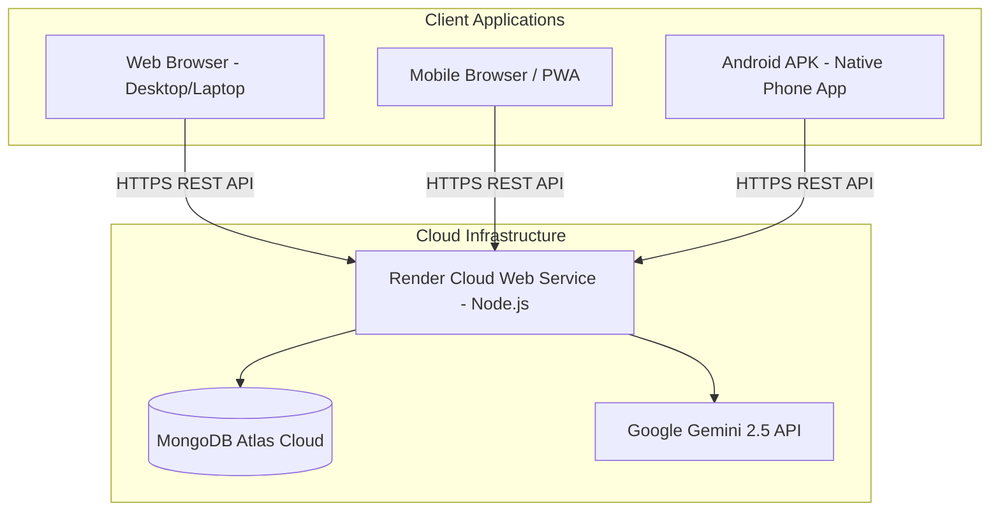

# PrepTrack AI — Deployment & Mobile APK Generation Guide

This guide explains how to deploy **PrepTrack AI** to **Render** and how to run it as a **Native Mobile Application (Android APK)** on your phone.

---

## 📱 Part 1: How Mobile Works with a Render Deployment

When you deploy your backend to **Render**, Render hosts your Express.js server and exposes a public HTTPS endpoint, for example:
```
https://preptrack-backend.onrender.com/api
```

Your MongoDB database is **already hosted in the cloud on MongoDB Atlas**, which means:
- Any mobile app (Android APK / iOS) connects directly to `https://preptrack-backend.onrender.com/api`.
- All your study data, daily streaks, quiz answers, and notes are **instantly synchronized across web and mobile**.
- If you practice DSA problems on your laptop, your progress updates on your phone in real time.



---

## 🚀 Part 2: Deploying to Render (Step-by-Step)

Render provides free hosting for both Web Services (Node.js) and Static Sites (React).

### Step 1: Push Code to GitHub
1. Create a repository on GitHub (e.g. `preptrack-ai`).
2. Push your `LearnWithT` project to GitHub.

---

### Step 2: Deploy Backend to Render (Web Service)
1. Go to [dashboard.render.com](https://dashboard.render.com) and click **"New +"** -> **"Web Service"**.
2. Connect your GitHub repository.
3. Configure the settings:
   - **Name**: `preptrack-backend`
   - **Root Directory**: `backend`
   - **Runtime**: `Node`
   - **Build Command**: `npm install`
   - **Start Command**: `node server.js`
   - **Instance Type**: `Free`
4. Add **Environment Variables** (under the "Environment" tab):
   - `PORT`: `5000`
   - `NODE_ENV`: `production`
   - `MONGODB_URI`: `your_mongodb_atlas_connection_string`
   - `JWT_SECRET`: `your_jwt_secret_key`
   - `GEMINI_API_KEY`: `your_gemini_api_key_optional`
5. Click **"Create Web Service"**.
   - Render will deploy the backend and give you a URL like:
     `https://preptrack-backend.onrender.com`

---

### Step 3: Deploy Frontend to Render (Static Site)
*(You can also use Vercel or Netlify for the frontend)*

1. In Render, click **"New +"** -> **"Static Site"**.
2. Connect the same GitHub repository.
3. Configure:
   - **Name**: `preptrack-ai`
   - **Root Directory**: `frontend`
   - **Build Command**: `npm run build`
   - **Publish Directory**: `dist`
4. Add Environment Variable:
   - `VITE_API_URL`: `https://preptrack-backend.onrender.com/api`
5. Click **"Create Static Site"**.
   - Your web app is now live at `https://preptrack-ai.onrender.com`!

---

## 📦 Part 3: How to Build the Android APK

The recommended industry-standard way to turn a React + Vite application into a native Android APK is **Capacitor (by Ionic)**. It runs your React frontend in an optimized native Android container and connects to your Render backend.

### Option A: Using Capacitor (Full Native Android APK)

#### Step 1: Install Capacitor in your `frontend`
Open your terminal in `d:\Projects\LearnWithT\frontend`:
```bash
cd frontend
npm install @capacitor/core @capacitor/cli @capacitor/android
```

#### Step 2: Initialize Capacitor
```bash
npx cap init PrepTrackAI com.preptrack.ai --web-dir dist
```

#### Step 3: Configure Render API URL for Mobile
Create or edit `frontend/.env.production`:
```env
VITE_API_URL=https://preptrack-backend.onrender.com/api
```

#### Step 4: Build the React Application
```bash
npm run build
```

#### Step 5: Add Android Platform
```bash
npx cap add android
```
This generates a complete `android/` native project folder containing the Gradle build files and Android Manifest!

#### Step 6: Build the APK File
You have two choices:

**Method 1 — With Android Studio (Visual GUI):**
```bash
npx cap open android
```
- Android Studio opens.
- Click **Build** -> **Build Bundle(s) / APK(s)** -> **Build APK(s)**.
- Once finished, Android Studio shows a popup: *"APK(s) generated successfully."* Click **"locate"** to find `app-debug.apk`.

**Method 2 — Command Line (Without opening Android Studio GUI):**
```bash
cd android
./gradlew assembleDebug
```
The output APK file will be located at:
```
frontend/android/app/build/outputs/apk/debug/app-debug.apk
```

#### Step 7: Install on Your Mobile Phone
1. Transfer `app-debug.apk` to your phone (via WhatsApp, Google Drive, Telegram, or USB cable).
2. Tap on the APK file on your phone and choose **Install** (if prompted, enable "Allow installation from this source").
3. Launch **PrepTrack AI** on your phone! It will load the UI and connect to your Render backend & Atlas database.

---

### Option B: Progressive Web App (PWA) — Instant App (No Android Studio Needed!)

If you want an app on your phone **right now** without installing Android Studio:

1. Deploy the frontend to Render or Vercel (e.g. `https://preptrack-ai.onrender.com`).
2. Open that URL on your mobile phone in **Google Chrome** (Android) or **Safari** (iPhone).
3. In Chrome: Tap the **three vertical dots (⋮)** in the top-right corner -> Tap **"Install app"** or **"Add to Home Screen"**.
4. In Safari (iOS): Tap the **Share** button -> Tap **"Add to Home Screen"**.
5. An app icon named **"PrepTrack AI"** will appear on your phone's home screen.
6. When opened, it runs in **full-screen standalone mode without any browser URL bar**, looking and feeling exactly like a native app!

---

## 🛠️ Summary Checklist

| Task | Status / Command |
|---|---|
| Cloud Database | ✅ Connected to MongoDB Atlas (`cluster0.8i9hklr.mongodb.net`) |
| Backend CORS | ✅ Configured to accept all mobile origins |
| Dynamic API URL | ✅ Configured in `axiosClient.js` (`import.meta.env.VITE_API_URL`) |
| Render Backend | Deploy as Web Service (`node server.js`) |
| Render Frontend | Deploy as Static Site (`dist`) |
| Generate APK | `npx cap add android` -> `./gradlew assembleDebug` |
